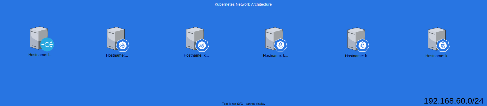

## Lal para treinamento e prática para o exame CKA

O arquivo Vagrant criar máquina vituais usando o Ubuntu - - master(s), worker and load-balancer. 

**Master nodes** foram preparados para instalar o cluster k8s.

**Load Balancer node** foi preparado com:
  - Configuração simples do haproxy;
  - Export NFS simples ```/opt/vol/``` para testar volumes persistentes.

### Diagrama de laboratório com detalhes



### Configurar rede:

Endereços IP internos (você pode copiar o seguinte para o seu arquivo ```/etc/hosts```:
```bash
192.168.60.200 lbnode  
192.168.60.201 kubemaster01 ckamaster  
192.168.60.202 kubemaster02  
192.168.60.203 kubemaster03  
192.168.60.204 kubework01  
192.168.60.205 kubework02  
```

### Exemplo de criação do construção

#### Para um master e um worker:

Você vai usar:
  * vCPU: 3
  * RAM: 6GB

```
root@pop-os:~# vagrant up kubemaster01 kubework01
```  

#### Para um master, um worker and lb:

Você vai usar:
  * vCPU: 4
  * RAM: 6.5 GB

```
root@pop-os:~# vagrant up kubemaster01 kubework01 lbnode
```  

#### Para criar todas VMs:

Você vai usar:
  * vCPU: 7
  * RAM: 12.5 GB

```
root@pop-os:~# vagrant up
```  

### Como se conectar as VMs

Você pode se conectar a todos os nós usando o usuário "user" e enviando a chave privada:

```
root@pop-os:~# ssh user@192.168.60.201 -i key_rsa
``` 

Ou usando o vagrant para conectar:

```
root@pop-os:~# vagrant ssh NAMEVM
``` 

Você pode usar o usuário **vagrant** com senha **vagrant**.

Divirta-se! 😃